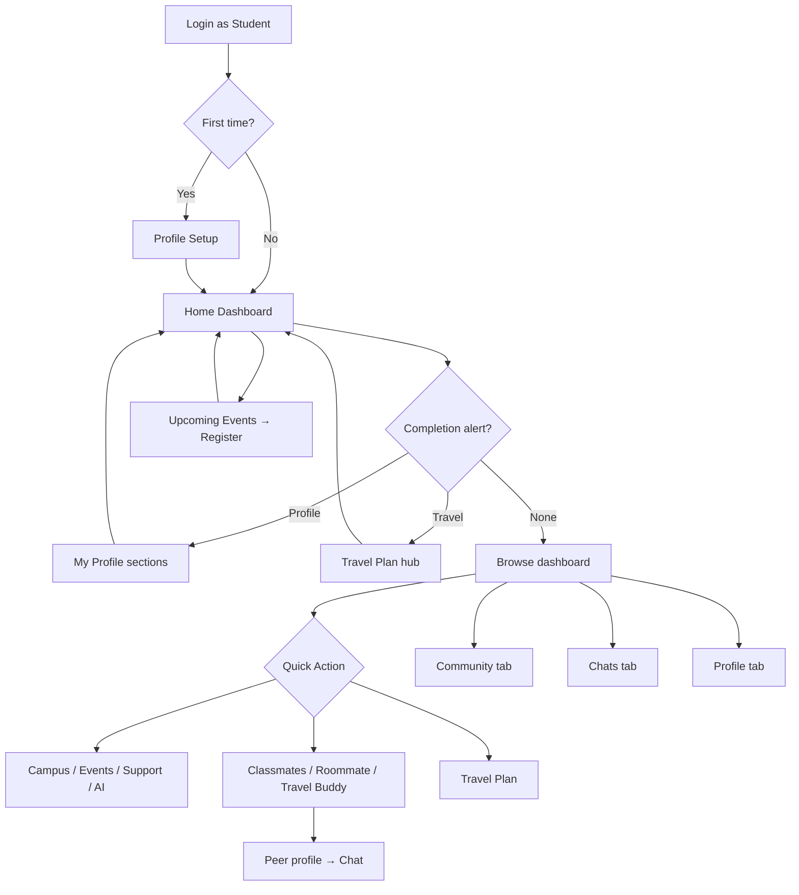

# Intoto — Student
## Features & Flows (User Guide)

**Design reference:** [Intoto Wireframe — Prototype (node 5051-661)](https://www.figma.com/proto/BSt8IrK987At3ZBXfyUbyY/Intoto-wireframe?node-id=5051-661&t=Fqpnfj5F0UbdlVZB-1)  
**Role:** Student (`student`)  
**Audience:** Product, Engineering, QA, Client demos  
**Version:** 1.0  
**Last updated:** Jun 2026

---

## About this document

This guide explains **what a Student can do in Intoto**, **why each feature exists**, and **exactly how to use it** — step by step. It follows the same style as the University Super Admin and Third Party Coordinator guides.

**Note on Figma access:** The live [Figma prototype](https://www.figma.com/proto/BSt8IrK987At3ZBXfyUbyY/Intoto-wireframe?node-id=5051-661&t=Fqpnfj5F0UbdlVZB-1) requires sign-in and could not be rendered frame-by-frame in this environment. This document is built from the wireframe scope (Student role under node 5051-661), the iOS Student implementation (`DashboardViewController`, profile/travel/buddies modules), and backend-driven dashboard config. Use Figma side-by-side to validate visual copy, spacing, and any frames not yet wired in the app.

---

## 1. Who is the Student?

### What this role is

The **Student** is the primary end-user of Intoto — an incoming or current university student preparing for campus life. They complete their profile and travel plan, discover events and communities, connect with classmates and travel buddies, and communicate with ambassadors and staff.

They are **scoped to one university and campus** (assigned at invitation). They do **not** manage other users, approve communities, or see admin stat cards.

### What they typically do day to day

- Complete profile and travel plan sections (often prompted by dashboard alerts)
- Browse campus info, events, and promotional banners
- Register for upcoming events
- Find roommates, classmates, or travel buddies
- Join or create communities (student-created communities go through approval)
- Chat with peers, ambassadors, and coordinators
- View ambassador profiles from the dashboard
- Accept additional role invitations (e.g. Ambassador) when offered

---

## 2. Getting into the app

### Feature: Login

**What the user does:** Signs in with university credentials (Auth0).

**How to do it:**
1. Open the Intoto app.
2. Enter email/password or use configured SSO.
3. Wait for profile and role to load.

**What happens next:**
- **Single role (Student only):** May see **University Powered By** splash, then **Home** dashboard.
- **Multiple roles:** **Role Selection** screen first — choose **Student**.
- **First-time user:** May see **Profile Setup** (basic details + photo) before the main tab bar.
- **Incomplete onboarding:** Dashboard shows a **completion alert** (profile or travel).

---

### Feature: Role selection (multiple roles only)

**What it is:** Lets one person switch between roles (e.g. Student vs Ambassador vs Coordinator).

**When the user needs it:** They hold more than one role and want a different context.

**How to do it:**
1. On login, choose **Student** from the role list, **or**
2. From the dashboard header, tap the **role switcher** row (if shown), **or**
3. Go to **Profile** tab → switch role.

**What happens next:** The app reloads the dashboard and tabs for the selected role. Students land on `DashboardViewController` (student home), not the admin overview dashboard.

---

### Feature: Profile setup (first login)

**What it is:** A one-time onboarding form after initial login — basic fields and optional profile photo.

**How to do it:**
1. Fill required fields on the setup screen (name, contact, etc. — API-driven).
2. Optionally add a profile photo (pick → crop → upload).
3. Tap **Continue**.

**What happens next:** User enters the main app (tab bar with Home, Community, Chats, Profile).

---

### Feature: Bottom navigation (main app areas)

**What it is:** Four primary areas, always visible from the bottom bar.

| Tab | What the user does here |
|-----|-------------------------|
| **Home** | Dashboard — alerts, banners, shortcuts, events, ambassadors |
| **Community** | Browse communities, read/create posts, join groups |
| **Chats** | Message peers, ambassadors, and staff |
| **Profile** | Settings, FAQs, logout — and entry to **My Profile** sections |

**How to use it:** Tap any tab icon. The selected tab is highlighted.

---

## 3. Home — Student Dashboard

### What it is

The **Student Home dashboard** is the student’s landing screen. Unlike admin roles, students **do not see Quick Way stat cards** — the dashboard is content- and action-oriented: completion alerts, promotional banners, shortcut tiles, events, activities, and ambassador highlights. All sections are **configured by the backend** for the Student role.

**How to open it:** Tap **Home** in the bottom tab bar (default after login).

**How to refresh:** Pull down on the dashboard. Counts, events, and alerts update from the server.

**Screen used in app:** `DashboardViewController` (student-specific; admin roles use `DashboardOverviewViewController`).

---

### Feature: University header (logo + name)

**What it is:** The navigation bar shows the university logo and full name at the top of Home.

**Why it matters:** The student always knows which institution they belong to.

**How to use it:**
1. Look at the top of Home — logo (if available) and university name.
2. **Bell icon** (top-right) → **Notifications**.
3. **Envelope icon** (top-right, when shown) → **Pending Invitations** (after deferring a role invite).

**Note:** Logo tap behavior may be informational only on student home; campus details are opened via **My Campus** quick action.

---

### Feature: Role switcher (multi-role accounts)

**What it is:** A row below the nav bar showing the current role name with a chevron.

**How to use it:** Tap the row → **Role Selection** → pick another role or return to Student.

---

### Feature: Profile / travel completion alert

**What it is:** A prominent banner at the top of the dashboard when profile or travel data is incomplete.

**Why it matters:** Drives students to finish onboarding so they are visible to peers and coordinators.

**Alert types (from API `identifier`):**

| Alert type | Meaning | Tap action |
|------------|---------|------------|
| **INCOMPLETE_PROFILE_DATA** | Profile sections incomplete | Opens **My Profile** (section hub) |
| **INCOMPLETE_TRAVEL_DATA** | Travel plan sections incomplete | Opens **Travel Plan** hub |
| **NO_ROLE** | No active role assigned | Informational (no navigation) |

**How to use it:**
1. Read the alert title and description (e.g. “Completing your profile — Enhances your visibility to others”).
2. For profile alert: note the **progress ring** (percentage complete).
3. **Tap the alert** to jump directly to the relevant hub.
4. After saving sections, return to Home — alert updates or disappears when complete.

---

## 4. Dashboard content sections

Sections appear **in API order** when the backend provides data. Typical Student dashboard includes:

| Section | What the user sees | What the user does |
|---------|-------------------|-------------------|
| **Banner** | Horizontal carousel of promotions | Swipe cards; tap CTA or card → external URL or in-app link |
| **Quick Actions** | Grid of shortcut tiles (Features) | Tap tile → destination screen |
| **My Events** | Events the student registered for or created | Tap event → details; **View All** → my events list |
| **Upcoming Events** | University events coming soon | Swipe carousel; tap → **Event Details**; **View All** → upcoming list |
| **Activities** | Sponsored / partner promotions | Swipe carousel; tap → `action_url` (often opens browser) |
| **Ambassadors** | Featured ambassador cards | Tap person → profile; **View All** → ambassador directory |

**Sections NOT shown for Student:** Quick Way stat cards (Total Students, Manage User, etc.) — those are admin-only.

---

## 5. Quick Actions (Features)

### What it is

**Quick Actions** are shortcut tiles on the dashboard (API `features` items). Each tile has an icon, label, and `actionId` that routes to a screen.

**How to use it:**
1. Scroll to the **Features** / quick actions area on Home.
2. Tap any tile.
3. Complete the flow on the destination screen.
4. Use back navigation or Home tab to return.

### Supported Quick Actions (Student)

| `actionId` | Label (typical) | Destination |
|------------|-----------------|-------------|
| `viewCampus` | My Campus | **Campus Details** (campus info, logo, location) |
| `viewTravelPlan` | Travel Plan | **Travel Plan hub** (section list) |
| `viewEvents` | Events | **All Events** list |
| `viewSupport` | Support | **Support** screen |
| `viewAskAI` | Ask AI | **AI Search** (voice/text university assistant) |
| `connectWithClassmate` | Connect with Classmates | **Classmate discovery** list |
| `findRoommate` | Find Roommate | **Roommate discovery** list |
| `travelBuddy` | Travel Buddy | **Travel buddy** list |
| `myEvents` | My Events | **My Events** list |

**Note:** Which tiles appear depends on backend config — not every student dashboard shows all actions above.

---

### My Campus

**What it means:** Details about the student’s assigned campus.

**How to do it:**
1. Tap **My Campus** on the dashboard.
2. Read campus name, logo, address, and related info on **Campus Details**.

---

### Travel Plan (quick action)

**What it means:** Entry to the travel onboarding hub (see [Section 8](#8-travel-plan)).

**How to do it:**
1. Tap **Travel Plan** on the dashboard (or the travel completion alert).
2. Complete sections in the travel hub.

---

### Events (quick action)

**What it means:** Browse all university events.

**How to do it:**
1. Tap **Events** on the dashboard.
2. Browse the list → tap an event → **Event Details** (see [Section 11](#11-events)).

---

### Support

**What it means:** Help / contact channel for university or Intoto support.

**How to do it:**
1. Tap **Support** on the dashboard.
2. Use the support content or contact options shown on the screen.

---

### Ask AI

**What it means:** AI-powered search for university FAQs and guidance.

**How to do it:**
1. Tap **Ask AI** (when configured).
2. Type or speak a question.
3. Read AI responses in the conversation list.

---

### Connect with Classmates

**What it means:** Discover other students at the same university to connect with.

**How to do it:**
1. Tap **Connect with Classmates**.
2. **Search** (3+ characters, debounced) or tap **Filter**.
3. Apply filters (campus, program, preferences, etc. — API-driven categories).
4. Tap a student row → **Peer profile** (limited sections based on visibility rules).
5. From profile: start **Chat** or other contact actions if available.

---

### Find Roommate

**What it means:** Find students looking for housing / roommates.

**How to do it:**
1. Tap **Find Roommate**.
2. Search and filter the student list (same pattern as classmates).
3. Tap a row → peer profile.
4. Optional: **Send email** from list actions where enabled.

---

### Travel Buddy

**What it means:** Find students traveling on similar dates/routes.

**How to do it:**
1. Tap **Travel Buddy** on the dashboard, **or**
2. From **Travel Plan hub** → **Connect with Other Travellers** (requires travel plan completion).
3. Search and filter travel buddies.
4. Tap a row → peer profile.

**Gate:** From the travel hub, if the travel plan is incomplete, the app shows a message to complete the travel plan first.

---

## 6. Banners and activities

### Promotional banners

**What the user does:** Discovers campus promotions, job fairs, workshops, etc.

**How to do it:**
1. On Home, find the **banner carousel** (auto-scroll may be enabled).
2. Swipe horizontally between banners.
3. Tap a banner or its **CTA** button → opens `action_url` (in-app WebView or external browser).

---

### Activities

**What the user does:** Sees partner or sponsored content (housing, bootcamps, webinars).

**How to do it:**
1. Scroll to **Activities** on Home.
2. Swipe through cards.
3. Tap card or CTA → external or partner URL.

---

## 7. My Profile (section hub)

### What it is

**My Profile** is the student’s own data hub — a list of profile sections with completion status. Opened from the Profile tab, dashboard alert, or **My Profile** menu item.

**Form ID:** `studentForm` (backend-driven section list and order).

**Screen:** `UserProfileSectionsViewController`

**How to open:**
- Tap profile completion **alert** on Home, **or**
- **Profile tab** → **My Profile**, **or**
- Navigation from related flows after login.

---

### Profile header

**What the user sees:** Photo, name, email at the top of the section list.

**How to manage photo:**
1. Tap the **Picture** section row, **or** use header edit affordance.
2. Choose **View**, **Change**, or **Remove** profile image.
3. Change: pick from library → crop → upload.

---

### Profile sections (typical)

Sections and order come from `GET user-profile/:formId/sections`. Common sections:

| Section | What the user enters | Why it matters |
|---------|---------------------|----------------|
| **Basic Details** | Name, DOB, gender, country, student ID, etc. | Core identity for university records |
| **Preferences** | Interests, languages, social preferences | Matching with classmates / roommates |
| **Contact Info** | Phone, addresses (current/permanent) | Reachability for coordinators |
| **Emergency Contact** | One or more emergency contacts (up to 3) | Safety requirement |
| **Education** | School history, qualifications | Academic context |
| **Personal Documents** | ID, visa, proofs (upload/review status) | Compliance and verification |
| **Shared by University** | Documents uploaded by admin for this student | Read/download university-provided files |
| **Program Details** | Campus, program, term/induction | Links student to academic program |
| **Picture** | Profile photo | Visibility in social/discovery lists |

**How to complete any section — step by step:**
1. Open **My Profile**.
2. Tap a section row (shows complete/incomplete status).
3. Fill or edit fields on the section screen (fields are API-configured: required, visible, editable).
4. Tap **Save** on the bottom bar when changes were made.
5. Use **Next** in the navigation bar to move to the following section (guided flow).
6. If leaving with unsaved changes, confirm **Save** or **Discard**.
7. Return to section list — status updates; dashboard alert progress increases.

---

### Guided section flow (Next / Previous)

**What it is:** Sequential navigation through profile sections without returning to the hub each time.

**How to use it:**
1. Open any section from the hub.
2. After saving, tap **Next** (top-right) → app opens the next section in API order.
3. Tap **Previous** to go back.
4. Unsaved edits trigger a confirmation dialog.

---

## 8. Travel Plan

### What it is

The **Travel Plan** captures how and when the student arrives — transport, documents, signature/consent — so coordinators can support arrival. It is separate from general profile but linked to the same account.

**Form ID:** `travelForm`

**Screen:** `TravelPlanSectionsViewController`

**How to open:**
- **Travel Plan** quick action on Home, **or**
- **Travel completion alert** on Home, **or**
- Profile → **Program Details** (program/induction lives in profile; travel sections live in travel hub).

---

### Travel sections (typical)

| Section | What the user enters |
|---------|---------------------|
| **Travel Details** | Arrival date/time, transport mode, flight/train numbers, destination address |
| **Travel Documents** | Tickets, visa copies, isolation/accommodation proofs |
| **Signature Documents** | Draw or upload signature; accept Terms & Conditions consent |

**Program Details** (campus, program, term) is edited from **My Profile**, not from the travel hub list.

---

### How to complete travel plan — step by step

1. Open **Travel Plan** from Home.
2. Wait for travel plan record to load (first visit may fetch/create plan).
3. Tap **Travel Details** → fill transport and arrival fields → **Save**.
4. Tap **Travel Documents** → upload required documents → submit.
5. Tap **Signature Documents** → draw signature or upload image → check consent → **Submit**.
6. Use **Next / Previous** between travel sections (same flow coordinator as profile).
7. When all sections complete, travel alert on Home clears.

---

### Signature and consent

**What the user does:** Legally acknowledges travel terms before submitting.

**How to do it:**
1. Open **Signature Documents** section.
2. Read consent text; tap **Terms & Conditions** link to view full terms (may load from URL).
3. Check the consent checkbox.
4. Draw on the signature canvas **or** upload a signature image.
5. Tap **Submit** (or **Save & Skip** where shown for partial save).

---

### Connect with Other Travellers

**What it is:** Button at the bottom of the Travel Plan hub.

**How to use it:**
1. Complete required travel plan sections first.
2. Tap **Connect with Other Travellers**.
3. Opens **Travel Buddy** list to find matching travelers.

---

## 9. Ambassadors

### What it is

**Ambassadors** are experienced students or staff who help newcomers. The dashboard can highlight featured ambassadors.

**How to use it:**
1. On Home, scroll to the **Ambassadors** section.
2. Swipe through ambassador cards.
3. Tap a card → **User Profile** (ambassador profile hub).
4. Tap **View All** → full **Ambassador List** → search/filter → tap row for profile.
5. From profile: **Chat** or view ambassador-specific info.

---

## 10. Community

### What it is

Students browse, join, and participate in university communities — groups organized by interest, program, or culture.

**How to open:** Tap **Community** in the bottom tab bar.

---

### Browse and join

**How to do it:**
1. Open **Community** tab.
2. Explore **feed**, **my communities**, or **discover** lists (tab structure per wireframe).
3. Tap a community → **Community Profile** (description, members, posts).
4. **Join** the community if not already a member.

---

### Read and create posts

**How to do it:**
1. Open a joined community.
2. Scroll the **feed**.
3. Tap a post → **Post detail** (comments, reactions as designed).
4. Tap **Create post** (if member) → compose text/media → publish.

---

### Create a community (Student)

**What is special:** Student-created communities require **approval** — they are not live immediately.

**How to do it:**
1. Community tab → **Create Community** (+ button or menu).
2. Enter **name**, **description**, upload **profile/cover** images if required.
3. Complete additional form fields.
4. Tap **Submit**.

**What happens next:** Alert — *“Your request to create a community has been submitted for approval. We’ll notify you within 24 hours.”* Admin approves or rejects via their dashboard.

---

## 11. Events

### Browse upcoming events

**How to do it:**
- **Home** → **Upcoming Events** carousel → tap event, **or**
- **Home** → **Events** quick action → full list, **or**
- Carousel **View All** → filtered upcoming list.

Tap any event → **Event Details**.

---

### Event Details — register

**What the user does:** Reads event info and registers when registration is open.

**How to do it:**
1. Open **Event Details** (title, date, location, description, capacity).
2. If registration is active, tap **Register Now** (primary button).
3. If the event has **additional questions**, answer them on the registration form → **Register Now**.
4. Success message confirms registration with event name and start date.
5. Event may appear under **My Events** on Home.

---

### My Events

**What it is:** Dashboard section listing events the student is registered for or created.

**How to do it:**
1. On Home, scroll to **My Events**.
2. Tap an event → details.
3. Tap **View All** → **My Events** full list.

---

### Event feedback (post-event)

**What it is:** After attending an event, the app may prompt for feedback when the student returns to Home.

**How to do it:**
1. Popup appears on dashboard: pending event feedback.
2. Tap **Give Feedback** → **Event Details** loads → **Event Feedback** screen.
3. Or tap **No Thanks** to dismiss.

---

## 12. Chat

### What it is

Direct messaging with other Intoto users — classmates, ambassadors, coordinators.

**How to open:** Tap **Chats** in the bottom tab bar.

**How to use it:**
1. See existing **chat threads** in the inbox list.
2. Tap a thread → read history → type message → send.
3. Unread counts and socket updates appear in real time.
4. To message someone new: open their **profile** from discovery lists (classmates, ambassadors, travel buddies) → **Chat** action.

**Student note:** Students typically cannot access admin bulk-email or user-management chat tools — messaging is peer-to-peer and support-oriented.

---

## 13. Profile tab (settings & account)

**How to open:** Tap **Profile** in the bottom tab bar.

| Menu item | What the user does | How |
|-----------|-------------------|-----|
| **My Profile** | Open section hub (same as alert destination) | Tap **My Profile** |
| **FAQs** | Read help articles | Tap **FAQs** |
| **Settings** | App preferences | Tap **Settings** |
| **About App** | Version and legal info | Tap **About App** |
| **Log out** | Sign out | Tap **Log out** → confirm |
| **Delete account** | Permanently remove account | Tap **Delete account** → confirm |

**Language:** Change via Settings → Language (app may restart if required).

---

## 14. Notifications and invitations

### Notifications

**What the user does:** Reads alerts for community approval, event reminders, chat, assignments, etc.

**How to do it:**
1. On Home, tap the **bell icon**.
2. Scroll the notification list.
3. Tap a notification → related screen (when deep link supported).

---

### Pending role invitations

**What it is:** If the student was invited to an **additional role** (e.g. Ambassador), an alert may appear at login.

**How to do it:**
1. On alert: **Accept** (switches context / loads new role) or **Do it later**.
2. If deferred: **envelope icon** appears on Home nav bar.
3. Tap envelope → **Pending Invitations** list → review and accept invites.

**Student-specific flow:** Accepting a student invitation may route through campus/program confirmation depending on invite type.

---

## 15. Filters — discovery lists

### What it is

**Filter** narrows classmates, roommates, and travel buddy lists by campus, program, country, languages, travel dates, etc.

**How to open:** On **Connect with Classmates**, **Find Roommate**, or **Travel Buddy** → tap **filter icon** next to search.

### How to apply filters — step by step

1. Tap **Filter** on the list screen.
2. Tap a **category** in the left sidebar.
3. **Search** options on the right (2+ characters where applicable).
4. **Select checkboxes** (multi-select allowed).
5. Tap **Apply** → filtered list returns.
6. **Cancel** discards changes; **Clear All** resets every filter.

### Visit Schedule / date filters

When available: pick **start** and **end** dates instead of checkboxes → **Apply**.

---

## 16. Peer profiles (viewing other students)

### What it is

When a student taps another person in discovery lists, they see a **peer profile** — not the full admin view.

**How to open:** Tap any row in Classmates, Roommates, Travel Buddy, or Ambassador lists.

**What they typically see (visibility-controlled):**
- Basic details and preferences (sections allowed for peer viewing)
- Program/campus summary where shared
- Actions: **Chat**, email (where enabled)

**What they do not see:** Coordinator assignment tools, admin actions, or sections hidden by visibility configuration.

---

## 17. Student permissions summary

| Can do | Cannot do |
|--------|-----------|
| Complete own profile and travel plan | Manage other users |
| Browse/join communities; create (pending approval) | Approve communities instantly |
| Register for events | Approve/reject events (admin) |
| Find classmates, roommates, travel buddies | Assign students to coordinators |
| Chat with peers and ambassadors | Access Quick Way admin stat cards |
| View campus and support content | Cross-university admin views |
| Accept additional role invitations | Bulk email entire student body |
| Use AI search (when enabled) | Suspend or invite users |

---

## 18. End-to-end flow diagram

---

## 19. Demo walkthrough (what to show a client)

| # | Show this | Say this |
|---|-----------|----------|
| 1 | Login as Student | “This is the student journey — onboarding through campus life.” |
| 2 | Dashboard alert + progress | “We nudge students to finish profile/travel — tap to continue.” |
| 3 | My Profile → one section → Save → Next | “Guided section flow with completion tracking.” |
| 4 | Travel Plan → Travel Details + Signature | “Arrival data and consent in one place.” |
| 5 | Connect with Other Travellers → Travel Buddy | “Social discovery after travel plan is ready.” |
| 6 | Find Roommate / Classmates → filter → profile | “Students find peers before arrival.” |
| 7 | Upcoming Events → Register | “Campus engagement built in.” |
| 8 | Ambassadors carousel → profile → chat | “Human support from day one.” |
| 9 | Community → Create → approval message | “Student safety — communities are moderated.” |
| 10 | Chats tab | “Everything stays in-platform.” |
| 11 | My Campus quick action | “Campus context always one tap away.” |
| 12 | Pull to refresh Home | “Dashboard stays current from the server.” |

---

## 20. Screen list (where each feature lives)

| Screen | How the user gets there |
|--------|-------------------------|
| Student Home Dashboard | Home tab after login |
| My Profile (section hub) | Alert, Profile tab → My Profile |
| Profile section editors | Tap section row in hub |
| Travel Plan hub | Travel quick action or travel alert |
| Travel section editors | Tap row in travel hub |
| Campus Details | My Campus quick action |
| All Events / Event Details | Events action or upcoming carousel |
| Event Registration | Event Details → Register |
| Connect with Classmates | Quick action |
| Find Roommate | Quick action |
| Travel Buddy | Quick action or travel hub button |
| Ambassador List | Ambassadors View All |
| Peer / Ambassador Profile | Tap row in any discovery list |
| Community feed & create | Community tab |
| Chats inbox & thread | Chats tab |
| Notifications | Bell on Home |
| Pending Invitations | Envelope on Home |
| Support | Support quick action |
| AI Search | Ask AI quick action (if configured) |
| Settings / FAQs / Logout | Profile tab |
| Role Selection | Role switcher or multi-role login |

---

## 21. Quick Action routing reference (engineering)

| `actionId` | iOS handler | Destination VC |
|------------|-------------|----------------|
| `viewCampus` | `didTapQuichAction` | `CampusDetailViewController` |
| `viewTravelPlan` | `openTravelPlanSections` | `TravelPlanSectionsViewController` |
| `viewEvents` | `openEventList` | Events list |
| `viewSupport` | `openSupport` | `SupportViewController` |
| `viewAskAI` | `openAISearch` | `AISerchVC` |
| `connectWithClassmate` | `openConnectWithClassmates` | `ConnectWithClassMatesViewController` |
| `findRoommate` | `openFindRoommates` | `FindRoommatesViewController` |
| `travelBuddy` | `openTravelBuddies` | `TravelMateViewController` |
| `myEvents` | `navigateToMyEvents` | `MyEventsListViewController` |

---

## Document history

| Version | Date | Change |
|---------|------|--------|
| 1.0 | Jun 2026 | Initial Student role guide (features, flows, step-by-step) |

---

## Related docs

- Client demo guide: `docs/Student-Client-Demo-Guide.md`
- QA test guide: `docs/Student-QA-Test-Guide.md`
- `docs/University-Super-Admin-Features-and-Flows.md`
- `docs/Third-Party-Coordinator-Features-and-Flows.md`

*Design reference: [Figma prototype — node 5051-661](https://www.figma.com/proto/BSt8IrK987At3ZBXfyUbyY/Intoto-wireframe?node-id=5051-661&t=Fqpnfj5F0UbdlVZB-1)*
