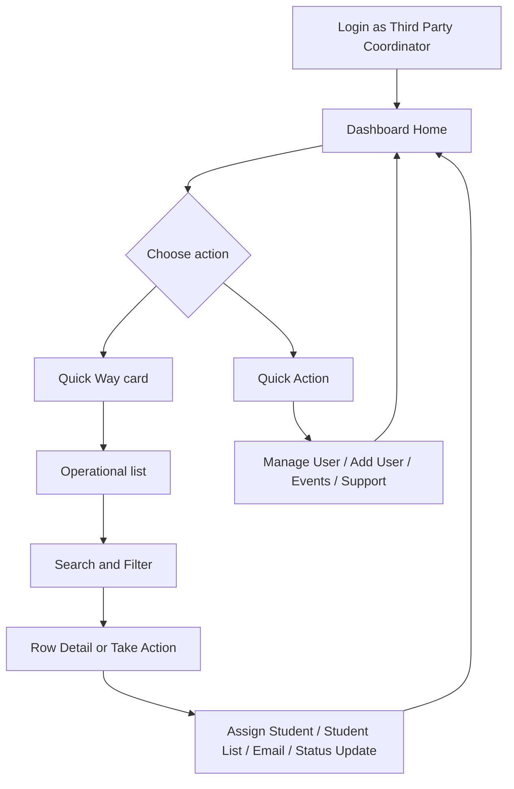

# Intoto - Third Party Coordinator
## Features and Flows Documentation

**Design reference:** [Intoto Wireframe - Prototype (node 5051-661)](https://www.figma.com/proto/BSt8IrK987At3ZBXfyUbyY/Intoto-wireframe?node-id=5051-661&t=Fqpnfj5F0UbdlVZB-1)  
**Role:** Third Party Coordinator (`thirdparty_coordinator`)  
**Audience:** Product, Engineering, QA, Client demos  
**Version:** 1.0  
**Last updated:** Jun 2026

---

## About this document

This document explains the Third Party Coordinator experience end to end:

- what screens are available
- what each feature is for
- what the user does on each screen
- how the user completes key operational flows

It follows the same style as the University Super Admin guide, but with role-specific behavior and actions.

---

## 1. Role summary

### What this role is

Third Party Coordinator is an operations-heavy role focused on student handling and coordinator-level staffing.

### Primary responsibilities

- track assigned and unassigned students
- review arrival requests
- manage sub-coordinator user lifecycle
- assign students to sub-coordinators
- monitor dashboard quick metrics
- communicate through chat and email actions

### Scope

- university-scoped operational role
- no cross-university administration
- fewer global governance permissions than University Super Admin

---

## 2. App shell and entry

## Login and landing

**How to use**
1. Login with Third Party Coordinator credentials.
2. If multiple roles are assigned, choose Third Party Coordinator.
3. App opens Home dashboard with role-specific cards and actions.

## Bottom tabs

| Tab | Purpose |
|-----|---------|
| Home | Dashboard overview and quick operations |
| Community | Community browse and related actions (as permitted) |
| Chats | Communication with users |
| Profile | Own profile and settings |

---

## 3. Home dashboard

The dashboard is API-driven and role-specific. Third Party Coordinator normally sees:

- custom top header with university name/logo
- role tag
- Quick Way cards focused on student operations
- Quick Actions shortcuts
- upcoming events and activities sections (when backend provides them)

## Header actions

**What user can do**
1. Tap university name/logo to open university/campus details.
2. Tap notification bell for notifications.
3. Tap pending invitation icon (if present) for pending invitations.

---

## 4. Quick Way (Third Party Coordinator)

Quick Way cards are operational entry points. Each card is tappable.

## Typical Third Party Coordinator Quick Way set

| Card | What it means | What user does |
|------|----------------|----------------|
| Total Students | all students in role scope | open student list, search/filter, open profiles |
| Assigned Students | students already assigned | monitor handled students |
| Total Sub Coordinator | sub-coordinator directory | view sub-coordinators and drill into their students |
| Total Arrival Requests | arrival requests count | open browse-only arrival requests and inspect details |
| Total Unassigned Requests | students needing assignment | run assign flow |
| Total ThirdParty Sub Coordinators | count of third-party sub-coordinators | same operational directory |

### How to use Quick Way

1. Open Home.
2. Scroll to Quick Way.
3. Tap a card.
4. Use search/filter on destination list.
5. Return to Home and pull to refresh if needed.

---

## 5. Quick Way routing map

This is the currently supported routing for coordinator-facing keys in the dashboard:

| `viewKey` | Destination |
|-----------|-------------|
| `quick_way_total_students` | All Students screen |
| `quick_way_total_assigned_students` | Assigned Student List |
| `quick_way_total_sub_coordinator` | Sub Coordinator List |
| `quick_way_total_arrival_requests` | Coordinator Assignment User List (arrival requests, browse-only) |
| `quick_way_total_unassigned_requests` | Unassigned Student List |
| `quick_way_total_thirdparty_sub_coordinators` | Sub Coordinator List |
| `quick_way_total_unassigned_students` | Unassigned Student List |
| `quick_way_my_assigned_requests` | Assigned Student List |
| `quick_way_my_upcoming_arrivals` | Sub Coordinator List |
| `quick_way_my_completed_arrivals` | no-op placeholder in current routing |

---

## 6. Quick Actions (Third Party Coordinator)

Typical quick actions shown for this role:

| Action | Purpose | Destination |
|--------|---------|-------------|
| Manage User | handle invitation/user lifecycle | Manage Users |
| Add User | invite new user | Add User |
| Events | browse events | All Events |
| Support | support/help flow | Support |

### How to use

1. From Home, go to Quick Actions.
2. Tap an action tile.
3. Complete the workflow and return to Home.

---

## 7. Manage Users for Third Party Coordinator

This screen is central for staffing operations.

## Status filters

Third Party Coordinator sees:

- All
- Invited
- Accepted
- Student Assigned
- Withdrawn
- Rejected
- Suspended

## What user can do

### Search and filter
1. Use search (debounced).
2. Tap filter icon to open User Filter.
3. Apply Campus/Role and related filters.

### Row-level and batch actions

Actions vary by selected status.

| Status | Available actions |
|--------|-------------------|
| Suspended | Withdraw Invite, Resend Invite, Send Email |
| Accepted / Student Assigned | Student List, Assign Student, Suspend Account, Send Email |
| Withdrawn / Rejected | Resend Invite, Send Email |
| All | Send Email (list-level) |

### How to run key actions

**Assign Student from Manage Users**
1. Select one coordinator row.
2. Tap Take Action.
3. Choose Assign Student.
4. App opens Unassigned Student List pre-scoped to that coordinator.

**Student List from Manage Users**
1. Select one coordinator row.
2. Tap Take Action.
3. Choose Student List.
4. App opens assigned students for that coordinator.

**Suspend account**
1. Select accepted row(s).
2. Take Action -> Suspend Account.
3. Confirm and refresh list.

---

## 8. Add User flow (Coordinator context)

Third Party Coordinator can invite users according to role visibility rules.

### How user invites someone

1. Open Add User from Quick Actions.
2. Select role.
3. Enter email(s).
4. Select campus when required.
5. Select ambassador type if role is ambassador/external ambassador.
6. Set expiry date.
7. Submit.

### Important validation behavior

- campus required for most operational roles
- ambassador type required for ambassador roles
- invalid or empty email blocks submit

---

## 9. Student operations

## Total Students

**What user does**
- search students
- filter by profile/travel attributes
- open student profile
- run batch communication actions

## Assigned Students

**What user does**
- monitor students already assigned to coordinators
- open student details

## Unassigned Students

**What user does**
- identify students without coordinator assignment
- start assignment flow

---

## 10. Assign student flow

This is a core Third Party Coordinator workflow.

### End-to-end steps

1. Open Unassigned Students.
2. Select one or more students.
3. Start Assign flow.
4. Fill setup:
   - target sub-coordinator
   - date range
   - work description
5. Configure profile visibility for assigned coordinator.
6. Confirm assignment.
7. Verify student moves to assigned list.

---

## 11. Sub-coordinator operations

Sub-coordinator list is opened from:

- Total Sub Coordinator card
- Total ThirdParty Sub Coordinators card
- My Upcoming Arrivals card

### What user does here

1. search and filter coordinators
2. open coordinator context
3. drill into coordinator-assigned students

---

## 12. Arrival requests flow

Opened from Total Arrival Requests card.

### Behavior

- list is browse-oriented for request inspection
- row tap opens Arrival Request Details
- assignment action is handled through unassigned flows, not this screen

### How to use

1. Open Total Arrival Requests.
2. Search/filter request list.
3. Tap a row to inspect request details.

---

## 13. Events and activities

When backend sections are present:

- Upcoming Events section: tap card to open Event Details; View All to event list
- Activities/Ads section: tap card CTA to open linked destination
- Quick Action Events: open all events directly

### How user uses events

1. Home -> Quick Actions -> Events or Home -> Upcoming Events.
2. Open event details.
3. Continue with role-permitted event actions.

---

## 14. Community and reports (role-dependent visibility)

Depending on backend configuration and permissioning for this role:

- community list flows may be visible from dashboard/community tab
- report stats/lists may be shown and routed from quick way

If visible, behavior follows:

- open list from quick way card
- search/filter list
- tap row for detail
- apply permitted status/action changes

---

## 15. Chat and communication

## Chats tab

1. Open Chats tab.
2. Search/select conversation.
3. Send and receive messages.

## Email from operational lists

1. Select one or more rows in Manage Users/Student lists.
2. Tap Take Action -> Send Email.
3. Compose and send from mail sheet.

---

## 16. Filters (User Filter screen)

Third Party Coordinator uses the same filter shell as other admin lists, with list-type specific categories.

### How user applies filters

1. Open list screen (Manage Users, Students, etc.).
2. Tap filter icon.
3. Select category from left sidebar.
4. Select values from right list.
5. Apply.
6. Use Clear All to reset all filters.

### Special case

- Visit Schedule category uses date range fields instead of checkbox list.

---

## 17. Notifications and pending invitations

## Notifications

1. Tap bell icon in dashboard header.
2. Open and review notification list.
3. Tap notification for deep-linked screen when provided.

## Pending invitations

1. If role invitation is deferred, envelope icon appears.
2. Tap envelope.
3. Open pending invitations and decide action.

---

## 18. Third Party Coordinator permissions summary

| Capability | Availability |
|------------|--------------|
| monitor student assignment health | yes |
| assign students to sub-coordinators | yes |
| manage coordinator invitation lifecycle | yes |
| view arrival requests | yes |
| send bulk operational emails | yes |
| cross-university management | no |
| global university-super-admin governance actions | limited / role-dependent |

---

## 19. End-to-end flow diagram

---

## 20. Demo checklist for this role

Recommended demo order:

1. Login and show role tag
2. Quick Way overview
3. Total Students -> search/filter -> student profile
4. Manage Users -> Accepted -> Assign Student action
5. Unassigned Students -> assignment flow
6. Total Arrival Requests -> open request detail
7. Events quick action
8. Chats tab and notification bell

---

## 21. Related docs

- `docs/University-Super-Admin-Features-and-Flows.md`
- `docs/University-Super-Admin-Client-Demo-Guide.md`
- `docs/University-Super-Admin-QA-Test-Guide.md`

